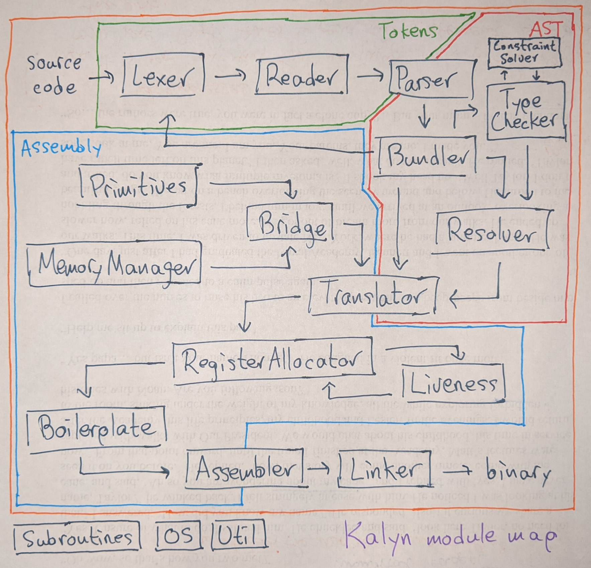

# Kalyn

Self-hosting compiler from a Haskell-like Lisp directly to x86-64,
developed fully from scratch.

  

Read all about it [on my
blog](https://intuitiveexplanations.com/tech/kalyn)!

## Build instructions

Install [Stack](https://docs.haskellstack.org/en/stable/README/). Keep
in mind on Arch-based Linux distributions that all the Haskell
packages in the official repos are totally unusable for devellopment,
so you need to install Stack using the upstream binaries. (See [this
HIE
issue](https://github.com/haskell/haskell-ide-engine/issues/1721#issuecomment-609847125).)

To compile the Haskell implementation (provide `VERBOSE=1` to write
intermediate log files into `out-kalyn`):

    $ make 1 [VERBOSE=1]

To use the Haskell implementation to compile the Kalyn implementation:

    $ make 2

To use the Kalyn implementation to compile itself:

    $ make 3
